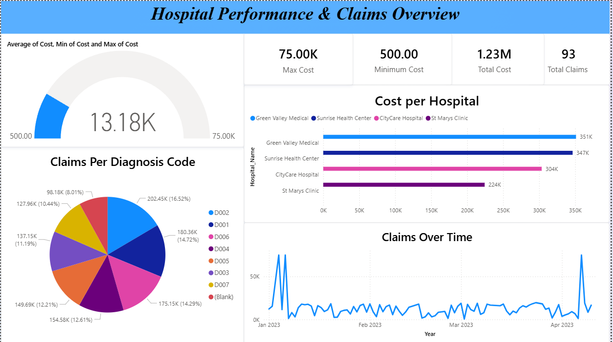

# 📊 Hospital Performance Data Analysis  

  

---

## 🔹 Project Overview  
This project simulates a **real-world healthcare data analysis workflow**.  
The main objective was to analyze hospital performance and healthcare claims by:  
- Cleaning messy raw data  
- Performing exploratory data analysis (EDA)  
- Building an interactive Power BI dashboard  

Through this project, I demonstrated **SQL for cleaning & transforming data**, **Excel for quick validation**, and **Power BI for dashboards** — all directly applicable to a Data Analyst role.  

---

## 🔹 Dataset  
The dataset is a **synthetic healthcare claims dataset**, structured similarly to real hospital data.  

It contains:  
- Claim and patient details  
- Hospital names  
- Diagnosis codes  
- Claim dates  
- Associated costs  

Extra irrelevant fields and intentionally messy entries were included to mimic real-world data challenges.  

---

## 🚀 Workflow  

### 🧹 1. Data Cleaning (SQL)  
- Removed **duplicates** using `ROW_NUMBER()` with **optimized CTEs**  
- Dropped **irrelevant columns**  
- Replaced missing `Diagnosis_Code` values with `"Unknown"`  
- Fixed **inconsistent hospital names** (e.g., `Ro$$bi Hospital` → `Robi Hospital`)  
- Converted **negative costs** to positive using `ABS()`  
- Removed rows with **0 cost**  
- Rounded **costs** to 2 decimal places  
- Fixed **date format inconsistencies**  

---

### 📊 2. Quick Checks in Excel  
- Created **pivot tables** for claims by hospital, diagnosis, and month  
- Used **conditional formatting** to highlight outliers  
- Validated that cleaned data matched expectations  

---

### 🔎 3. Exploratory Data Analysis (EDA)  
- Counted **distinct patients vs claims**  
- Analyzed **cost distribution per hospital**  
- Checked **claims per diagnosis code**  
- Studied **claims trend over time**  

---

### 📈 4. Dashboard & Reporting (Power BI)  
The final interactive dashboard includes:  
- 📌 **KPI Cards** → Total Claims, Total Cost, Max & Min Claim Cost  
- 🎯 **Gauge** → Avg Cost vs Min & Max  
- 📊 **Bar Chart** → Cost per Hospital  
- 🥧 **Pie Chart** → Claims by Diagnosis Code  
- 📉 **Line Chart** → Claims Trend Over Time  

---

## 🛠 Tools & Technologies  
- **SQL (MySQL)** → Data Cleaning & EDA  
- **Excel** → Quick Validation & Pivot Tables  
- **Power BI** → Dashboarding & Visualization  

---

## 📌 What I Learned  
- Optimizing SQL queries with **CTEs**  
- Handling **messy real-world data** (duplicates, missing values, date issues)  
- Combining **Excel quick insights** with advanced BI tools  
- Designing **effective dashboards** for storytelling  

---
